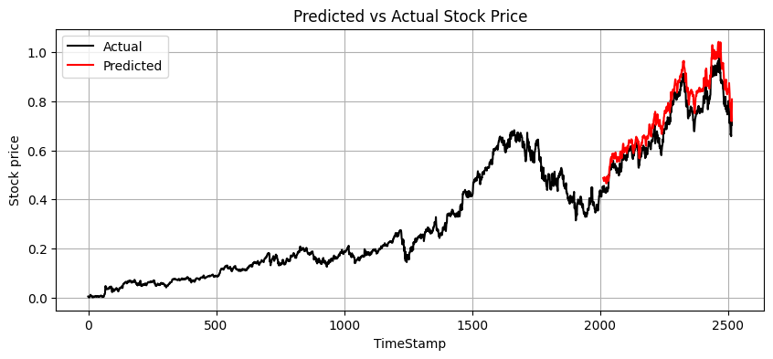

# Google Stock Price Prediction

## Overview

This project predicts Google's (GOOGL) stock price with a unique, industry-aware approach. Instead of relying solely on historical price data for a single company, the model first identifies stocks within and across related industries that are most correlated with Google. This selective, multivariate method improves forecasting by incorporating the market dynamics of peer companies.

## Novelty

- **Industry-Aware Filtering:**  
  Identifies and ranks companies not only in the same industry but also in connected sectors based on Pearson correlation. This informed feature selection enhances predictive power by leveraging cross-industry relationships.
  
- **Focused Data Integration:**  
  Only the most relevant, highly correlated stocks are used as inputs to the model, resulting in a leaner yet more robust prediction framework.

## Tech Stack

- **Programming Language:** Python  
- **Data Acquisition:** yfinance  
- **Data Handling:** Pandas  
- **Preprocessing:** scikit-learn (MinMaxScaler)  
- **Deep Learning Framework:** PyTorch  
- **Visualization:** Matplotlib

## Results

The model’s performance is evaluated using Mean Squared Error (MSE) and visual plots that compare the actual vs. predicted stock prices over time. The strategic selection of correlated stocks leads to improved accuracy relative to models using unfiltered inputs.

## License

This project is licensed under the Apache License. See the [LICENSE](LICENSE) file for details.

